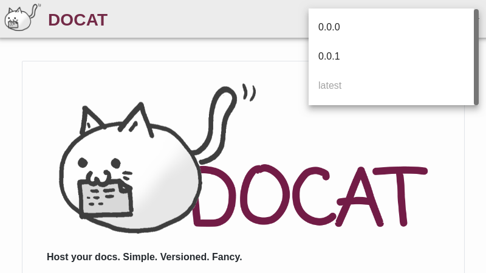

**Host your docs. Simple. Versioned. Fancy.**

[](https://github.com/docat-org/docat/actions)
[](https://gitter.im/docat-docs-hosting/community?utm_source=badge&utm_medium=badge&utm_campaign=pr-badge)

## Getting started

The simplest way is to build and run the docker container,
you can optionally use volumes to persist state:

```sh
# run container in background and persist data (docs, nginx configs and tokens database)
# use 'ghcr.io/docat-org/docat:unstable' to get the latest changes
mkdir -p docat-run/doc
docker run \
  --detach \
  --volume $PWD/docat-run:/var/docat/ \
  --publish 8000:80 \
  ghcr.io/docat-org/docat
```

Go to [localhost:8000](http://localhost:8000) to view your docat instance:



### Local Development

For local development, first configure and start the backend (inside the `docat/` folder):

```sh
# create a folder for local development (uploading docs)
DEV_DOCAT_PATH="$(mktemp -d)"

# install dependencies
poetry install

# run the local development version
DOCAT_SERVE_FILES=1 DOCAT_STORAGE_PATH="$DEV_DOCAT_PATH" poetry run python -m docat
```

After this you need to start the frontend (inside the `web/` folder):

```sh
# install dependencies
yarn install --frozen-lockfile

# run the web app
yarn serve
```

For more advanced options, have a look at the
[backend](docat/README.md) and [web](web/README.md) docs.

### Push Documentation to docat

The preferred way to push documentation to a docat server is using the [docatl](https://github.com/docat-org/docatl)
command line application:

```sh
docatl push --host http://localhost:8000 /path/to/your/docs PROJECT VERSION
```

There are also docker images available for CI systems.

#### Using Standard UNIX Command Line Tools

If you have static html documentation or use something like
[mkdocs](https://www.mkdocs.org/), [sphinx](http://www.sphinx-doc.org/en/master/), ...
to generate your documentation, you can push it to docat:

```sh
# create a zip of your docs
zip -r docs.zip /path/to/your-docs
# upload them to the docat server (replace PROJECT/VERSION with your projectname and the version of the docs)
curl -X POST -F "file=@docs.zip" http://localhost:8000/api/PROJECT/VERSION
```

When you have multiple versions you may want to tag some version as **latest**:

```sh
# tag the version VERSION of project PROJECT as latest
curl -X PUT http://localhost:8000/api/PROJECT/VERSION/tags/latest
```

Same thing with `docatl`:

```sh
# tag the version VERSION of project PROJECT as latest
docatl tag --host http://localhost:8000 PROJECT VERSION latest
```

## Advanced `config.json`

It is possible to configure some things after the fact.

1. Create a `config.json` file
2. Mount it inside your docker container `--volume /path/to/config.json:/var/www/html/config.json`

Supported config options:

- headerHTML

## Advanced Usage

### Install using Helm Chart

Example:

```bash
cd charts/

helm upgrade --install \
  --namespace default \
  docat ./docat
```

This chart is under construction

### Hide Controls

If you would like to send link to a specific version of the documentation without the option to change the version, you can do so by clicking on the `Hide Controls` button. This will hide the control buttons and change the link, which can then be copied as usual.
