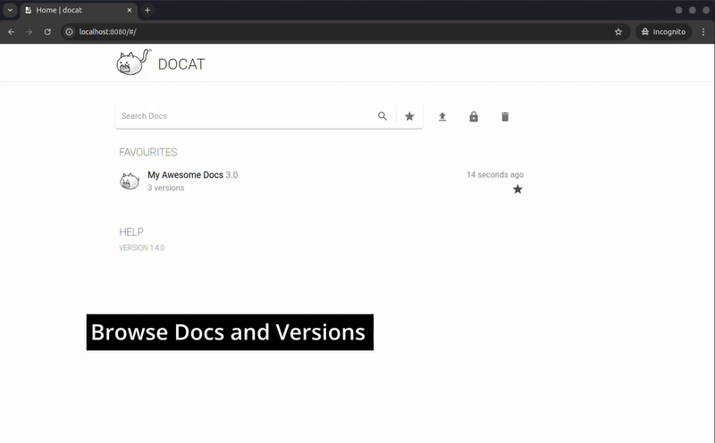

**Host your docs. Simple. Versioned. Fancy.**

[](https://github.com/docat-org/docat/actions)
[](https://gitter.im/docat-docs-hosting/community?utm_source=badge&utm_medium=badge&utm_campaign=pr-badge)

## Why DOCAT?

When generating static documentation using
[mkdocs](https://www.mkdocs.org/), [sphinx](http://www.sphinx-doc.org/en/master/), ...
hosting just one version of the docs might not be enough.
Many users might still use older versions and might need to read
those versions of the documentation.

Docat solves this problem by providing a simple tool that
hosts multiple documentation projects with multiple versions.

*The main design decision with docat was to keep the tool as simple as possible.*

## Getting started

The simplest way to get started is to run the docker container,
you can optionally use volumes to persist state:

```sh
# run container in background and persist data (docs, nginx configs and tokens database)
# use 'ghcr.io/docat-org/docat:unstable' to get the latest changes
mkdir -p docat-run/doc
docker run \
  --detach \
  --volume $PWD/docat-run:/var/docat/ \
  --publish 8000:80 \
  ghcr.io/docat-org/docat
```

Go to [localhost:8000](http://localhost:8000) to view your docat instance:



### Using DOCAT

> 🛈 Please note that docat does not provide any way to write documentation.
> It's sole responsibility is to host documentation.
>
> There are many awesome tools to write documenation:
> - [mkdocs](https://www.mkdocs.org/)
> - [sphinx](http://www.sphinx-doc.org/en/master/)
> - [mdbook](https://rust-lang.github.io/mdBook/)
> - ...


A CLI tool called [docatl](https://github.com/docat-org/docatl) is available
for easy interaction with the docat server.
However, interacting with docat can also be done through [`curl`](doc/getting-started.md).

To push documentation (and tag as `latest`) in the folder `docs/` simply run:

```sh
docatl push --host http://localhost:8000 ./docs PROJECT VERSION --tag latest
```

More detailed instructions can be found in the [**getting started guide**](doc/getting-started.md).

## Authentication

By default, anyone can upload new documentation or add a new version to documentation.
A project can be claimed. A claim returns a token that then must be used
to add or delete versions.

When hosting docat publicly, it is recommended to use
[http basic auth](https://docs.nginx.com/nginx/admin-guide/security-controls/configuring-http-basic-authentication/)
for all `POST`/`PUT` and `DELETE` http calls.

<details>
  <summary>docat http basic authentication example</summary>

This example shows how to configure the NGINX inside the docker image
to be password protected using http basic auth.

1) Create your [`.htpasswd` file](https://docs.nginx.com/nginx/admin-guide/security-controls/configuring-http-basic-authentication/#creating-a-password-file).
2) And a custom `default` NGINX config:

  ```
  upstream python_backend {
      server 127.0.0.1:5000;
  }

  server {
      listen 80 default_server;
      listen [::]:80 default_server;

      root /var/www/html;

      add_header Content-Security-Policy "frame-ancestors 'self';";
      index index.html index.htm index.pdf /index.html;

      server_name _;

      location /doc {
          root /var/docat;
      }

      location /api {
          limit_except GET HEAD {
              auth_basic 'Restricted';
              auth_basic_user_file /etc/nginx/.htpasswd;
          }

          client_max_body_size $MAX_UPLOAD_SIZE;
          proxy_pass http://python_backend;
      }

      location / {
          try_files $uri $uri/ =404;
      }
  }
  ```

1) Mounted to the correct location inside the container:

  ```
  docker run \
    --detach \
    --volume $PWD/docat-run:/var/docat/ \
    --volume $PWD/nginx/default:/app/docat/docat/nginx/default \
    --volume $PWD/nginx/.htpasswd:/etc/nginx/.htpasswd \
    --publish 8000:80 \
    ghcr.io/docat-org/docat
  ```
</details>

## Configuring DOCAT

#### Frontend Config

It is possible to configure some things after the fact.

1. Create a `config.json` file
2. Mount it inside your docker container `--volume $PWD/config.json:/var/docat/doc/config.json`

Supported config options:

```json
{
  "headerHTML": "<h1 style='color: #115fbf;'>Custom Header HTML!</h1>",
  "footerHTML": "CONTACT: <a href='mailto:maintainer@mail.invalid'>Maintainers</a>"
}
```

#### System Config

Further proxy configurations can be done through the following environmental variables:

| Variable | Default | Description |
|---|---|---|
| `MAX_UPLOAD_SIZE` | [100M](./Dockerfile) | Limits the size of individual archives posted to the API |


## Local Development

For local development, first configure and start the backend (inside the `docat/` folder):

```sh
# create a folder for local development (uploading docs)
DEV_DOCAT_PATH="$(mktemp -d)"

# install dependencies
poetry install --all-groups

# run the local development version
DOCAT_SERVE_FILES=1 DOCAT_STORAGE_PATH="$DEV_DOCAT_PATH" poetry run python -m docat
```

After this you need to start the frontend (inside the `web/` folder):

```sh
# install dependencies
yarn install --frozen-lockfile

# run the web app
yarn start
```

For more advanced options, have a look at the
[backend](docat/README.md) and [web](web/README.md) docs.
